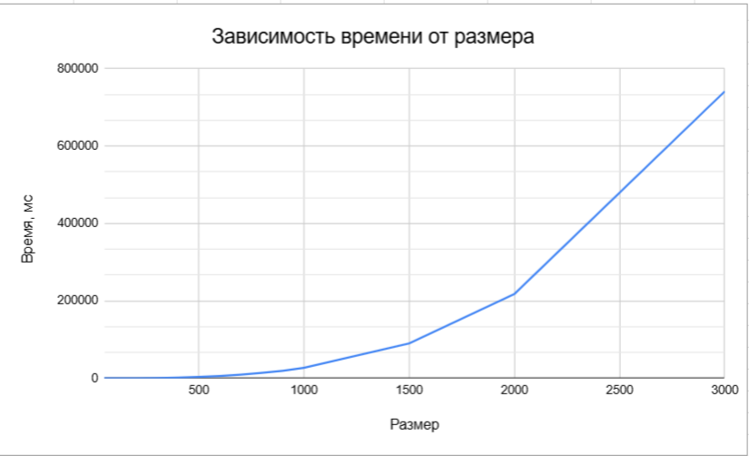

## Отчет по лабораторной работе №1 

### Задание на лабораторную работу: 
   Написать программу на языке C/C++ для перемножения двух матриц.
Исходные данные: файл(ы) содержащие значения исходных матриц.
Выходные данные: файл со значениями результирующей матрицы, время
выполнения, объем задачи.
Обязательна автоматизированная верификация результатов вычислений с помощью
сторонних библиотек или стороннего ПО (например на Matlab/Python).

### Исходный код решения расположен в данном репозитории
* [generate_write.cpp](generate_write.cpp) - основное задание: генерация, запись/чтение матриц из файла и их умножение
* [check.py](check.py) - модуль с функцией верификации полученный результатов с помощью библиотеки numpy
* [data](data) - папка со всеми сгенерированными матрицами, результатами умножения и статистикой (изначально данной папки не было и она создана только при выгрузке на гитхаб, для лучшей читаемости репозитория)
  
### Результаты экспериментов и выводы: 
Полученная статистика представлена ниже: 

|Размер|Время, мс|
|------------:|-------:|
|50	|21,5919|
|100|	75,1238|
|200|	378,409|
|300|	1036,11|
|400|	2179,94|
|500|	3839,95|
|600|	6228,26|
|700|	9651,17|
|800|	14370,7|
|900|	19733,1|
|1000|	27338,5|
|1500|	90101,5|
|2000|	217568|
|3000|	741044|

График: 

Вывод: При увеличении размерности матриц, время умножения увеличивается значительно. Время умножения матриц размерностью 1000 и 2000 отличается в ~8 раз, что свидетельсвует о кубическом росте времени выполнения алгоритма.
