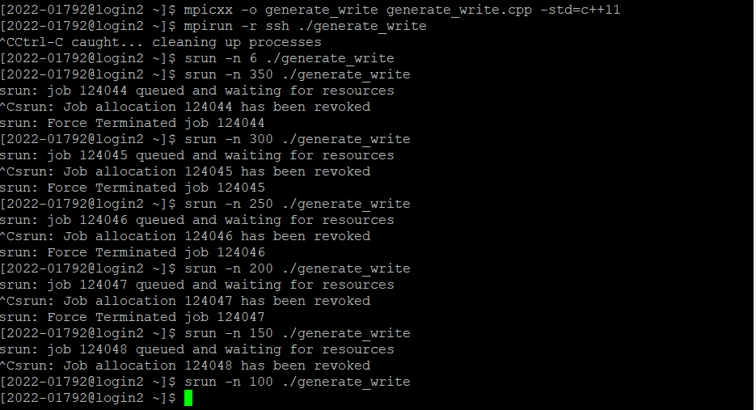
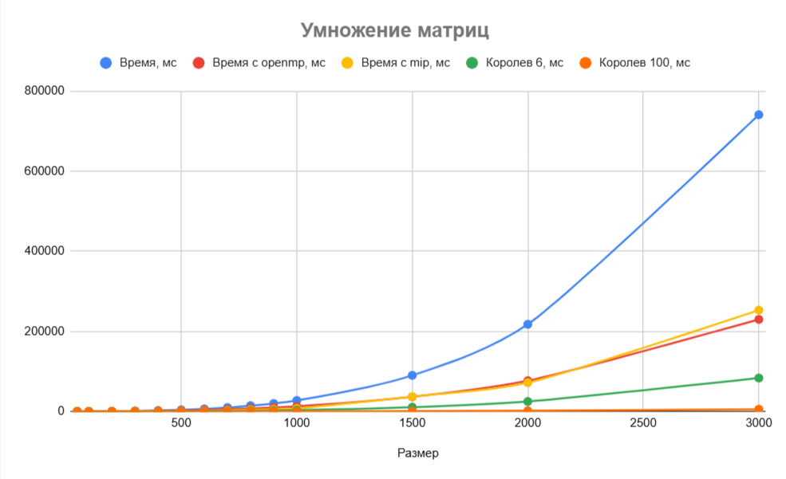
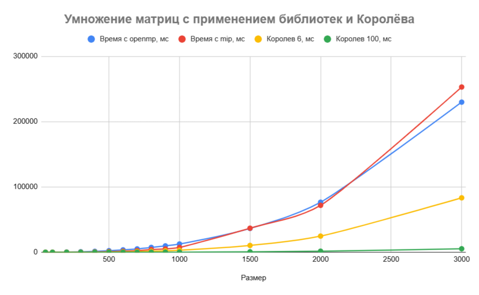

## Отчет по лабораторной работе №3

### Задание на лабораторную работу:
Модифицировать программу из л/р №1 для параллельной работы по
технологии MPI. Запустить параллельную версию на Суперкомпьютере Королёв. 

### Исходный код решения расположен в данном репозитории
* [generate_write.cpp](generate_write.cpp) - основное задание, измененное под 3ую л/р: генерация, запись/чтение матриц из файла и их умножение с помощью MPI.
* [main.py](main.py) - модуль с функцией верификации полученный результатов с помощью библиотеки numpy
* [data](data) - папка со всеми сгенерированными матрицами, результатами умножения и статистикой.

### Результаты экспериментов и выводы:
В коде была выполнена редукция для объединения частичных результатов умножения матриц, полученных на разных процессах MPI.

Подключение к суперкомпьютеру осуществлялось через программу эмулятор
терминала с поддержкой протокола SSH PuTTY, обмен данными через
WinSCP.
Изначально при подключении к суперкомпьютеру программа была запущена с 6 потоками, впоследствии подбиралось максимально возможное количество (от 350), запустить удалось при значении 100.

Полученная статистика представлена ниже:

| Размер | Время, мс | Время с OpenMP, мс | Время с MPI, мс | Королев 6, мс | Королев 100, мс |
|--------|-----------|--------------------|-----------------|---------------|-----------------|
| 50     | 21.5919   | 23.6381            | 0.95642         | 0.718536      | 16.4549         |
| 100    | 75.1238   | 73.3884            | 7.3404          | 4.21463       | 0.724551        |
| 200    | 378.409   | 347.007            | 59.2043         | 27.5572       | 3.66057         |
| 300    | 1036.11   | 789.086            | 199.523         | 86.3208       | 9.44508         |
| 400    | 2179.94   | 1428.98            | 467.476         | 211.847       | 19.06           |
| 500    | 3839.95   | 2404.84            | 943.365         | 399.037       | 35.1486         |
| 600    | 6228.26   | 3677.53            | 1584.77         | 674.445       | 56.0509         |
| 700    | 9651.17   | 5155.59            | 2568.7          | 1095.11       | 85.1714         |
| 800    | 14370.7   | 7419.25            | 4180.39         | 1606.8        | 128.791         |
| 900    | 19733.1   | 9784.96            | 5116.23         | 2265.12       | 168.537         |
| 1000   | 27338.5   | 12653.9            | 7398.44         | 3153.33       | 226.162         |
| 1500   | 90101.5   | 36496.5            | 36847.5         | 10448.9       | 714.156         |
| 2000   | 217568    | 76625              | 71844.8         | 24755         | 1641.5          |
| 3000   | 741044    | 229834             | 252973          | 83346.2       | 5367.95         |

График сравнения времени вычислений:

 
Так как параллельные версии работают значительно быстрее, уберу с графика данные о последовательной версии для лучшего представления.

### Вывод:
Опытным путем было выявлено, что наилучший результат получается при использовании 5-8 потоков.
MPI с 6 потоками обеспечивает значительное ускорение по сравнению с последовательным выполнением и OpenMP, особенно для задач среднего и крупного размера. На малых данных разница менее заметна из-за накладных расходов, но с ростом объема вычислений MPI демонстрирует лучшую масштабируемость. Однако на очень больших задачах (например, 3000 элементов) OpenMP может оказаться эффективнее из-за меньших затрат на межпроцессное взаимодействие.

Таким образом: 
* для кластера лучше использовать MPI
* для вычислений на одном компьютере при больших объемах OpenMP показывает себя лучше.

Отчет выполнила студент группы 6313-100503D Будюк В.А.