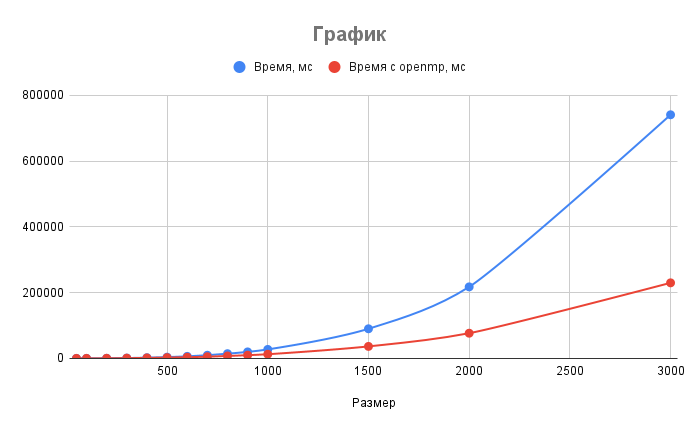

## Отчет по лабораторной работе №2 

### Задание на лабораторную работу: 
Модифицировать программу из л/р №1 для параллельной работы по
технологии OpenMP.

### Исходный код решения расположен в данном репозитории
* [main.cpp](main.cpp) - основное задание, измененное под 2ую л/р: генерация, запись/чтение матриц из файла и их умножение с помощью OpenMP.
* [main.py](main.py) - модуль с функцией верификации полученный результатов с помощью библиотеки numpy
* [data](data) - папка со всеми сгенерированными матрицами, результатами умножения и статистикой.

### Результаты экспериментов и выводы: 
Полученная статистика представлена ниже: 

|Размер|Время, мс|
|------------:|-------:|
|50	|23.6381|
|100|	73.3884|
|200|	347.007|
|300|	 789.086|
|400|	1428.98|
|500|	2404.84|
|600|	3677.53|
|700|	5155.59|
|800|	7419.25|
|900|	9784.96|
|1000|	12653.9|
|1500|	36496.5|
|2000|	76625|
|3000|	229834|

График сравнения время вычислений с OpenMP и без: 

### Вывод:
 OpenMP ускоряет перемножение матриц начиная с размеров 200×200, давая выигрыш до 3х раз для больших матриц. На малых размерах (50×50, 100×100) ускорения нет из-за накладных расходов на создание потоков и конкуренции за память. По полученным результатам оптимальный порог для использования OpenMP — 200×200.

 Отчет выполнила студент группы 6313-100503D Будюк В.А.