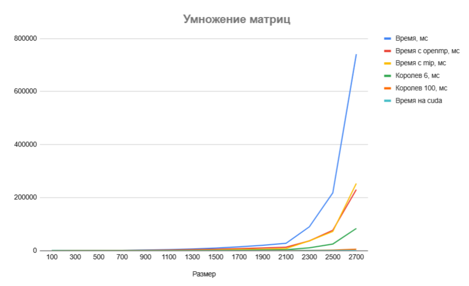
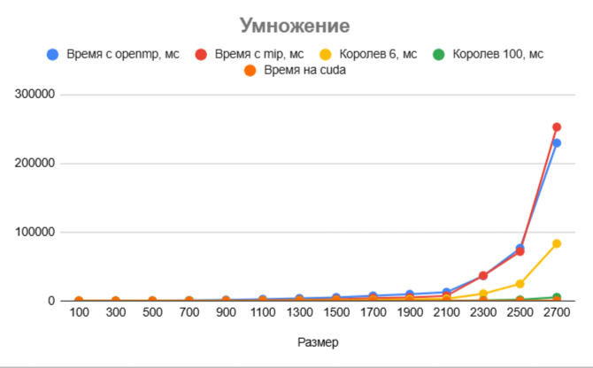

## Отчет по лабораторной работе №4

### Задание на лабораторную работу:
Модифицировать программу из л/р №1 для параллельной работы по
технологии CUDA.

### Исходный код решения расположен в данном репозитории
* [multiply.cu](multiply.cu) - основное задание, измененное под 4ую л/р: генерация, запись/чтение матриц из файла и их умножение с помощью CUDA.
* Лабораторная работа выполнялась с использованием видеокарты NVIDIA GeForce RTX 3050 Laptop GPU

### Результаты экспериментов и выводы:
Так как данная лаботаторная работа выполнялась на другой машине, то данные были измерены с другим шагом соответственно. Это не помешало составить графики.

Полученная статистика представлена ниже:

| Размер | Время, мс | Время с OpenMP, мс | Время с MPI, мс | Королев 6, мс | Королев 100, мс | 
|--------|-----------|--------------------|-----------------|---------------|-----------------|
| 50     | 21.5919   | 23.6381            | 0.95642         | 0.718536      | 16.4549         |
| 100    | 75.1238   | 73.3884            | 7.3404          | 4.21463       | 0.724551        |
| 200    | 378.409   | 347.007            | 59.2043         | 27.5572       | 3.66057         |
| 300    | 1036.11   | 789.086            | 199.523         | 86.3208       | 9.44508         |
| 400    | 2179.94   | 1428.98            | 467.476         | 211.847       | 19.06           |
| 500    | 3839.95   | 2404.84            | 943.365         | 399.037       | 35.1486         |
| 600    | 6228.26   | 3677.53            | 1584.77         | 674.445       | 56.0509         |
| 700    | 9651.17   | 5155.59            | 2568.7          | 1095.11       | 85.1714         |
| 800    | 14370.7   | 7419.25            | 4180.39         | 1606.8        | 128.791         |
| 900    | 19733.1   | 9784.96            | 5116.23         | 2265.12       | 168.537         |
| 1000   | 27338.5   | 12653.9            | 7398.44         | 3153.33       | 226.162         | 
| 1500   | 90101.5   | 36496.5            | 36847.5         | 10448.9       | 714.156         |
| 2000   | 217568    | 76625              | 71844.8         | 24755         | 1641.5          |
| 3000   | 741044    | 229834             | 252973          | 83346.2       | 5367.95         |

Таблица результатов при использовании CUDA:

| Размер | Время CUDA (мс) |
|--------|-----------------|
| 100    | 240             |
| 300    | 4               |
| 500    | 10              |
| 700    | 19              |
| 900    | 28              |
| 1100   | 40              |
| 1300   | 57              |
| 1500   | 84              |
| 1700   | 99              |
| 1900   | 138             |
| 2100   | 159             |
| 2300   | 271             |
| 2500   | 235             |
| 2700   | 447             |
| 2900   | 384             |
| 3100   | 432             |

График сравнения времени вычислений:

Так как параллельные версии работают значительно быстрее, уберем с графика данные о последовательной версии для лучшего представления.

### Вывод:
Легко заметить, что на небольших размерах CUDA работает даже хуже, чем последовательное умножение. Это можно объяснить расходами на передачу данных в GPU и инициализацию. Тем не менее, как только размеры матрицы увеличиваются, CUDA демонстрирует резкий рост производительности, и по своей эффективности становится сравнима с запуском программы на суперкомпьютере. 

Аномалии в данных (скачки времени при 2300–2500) могут быть связаны с оптимизациями работы видеопамяти или нагрузкой на систему. Таким образом, CUDA идеально подходит для ресурсоёмких вычислений.

Отчет выполнили студенты группы 6313-100503D Будюк В.А, Шаварина А.А. и Яковлева Я.А.